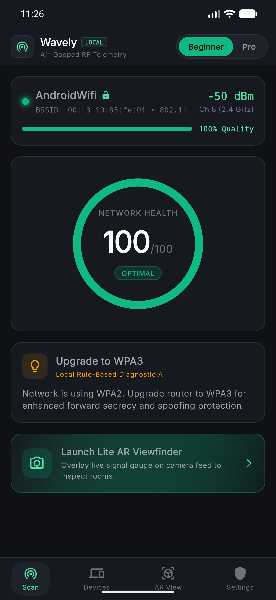
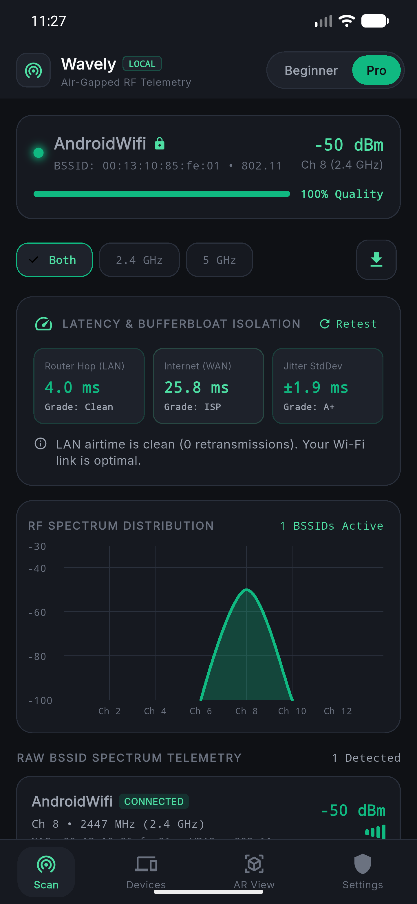
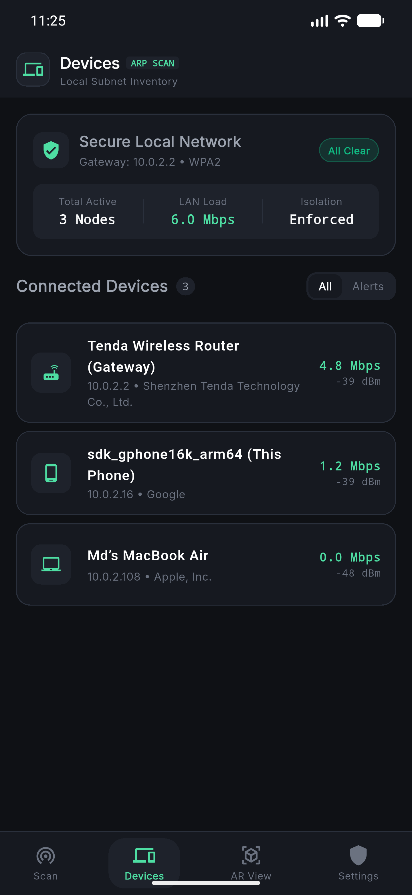
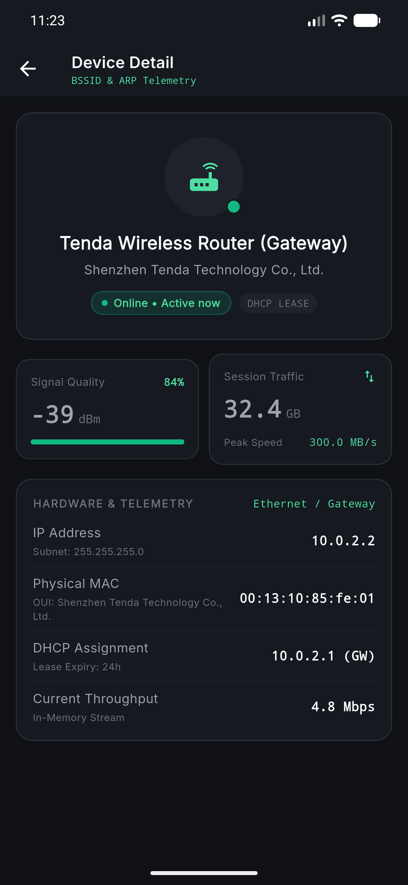
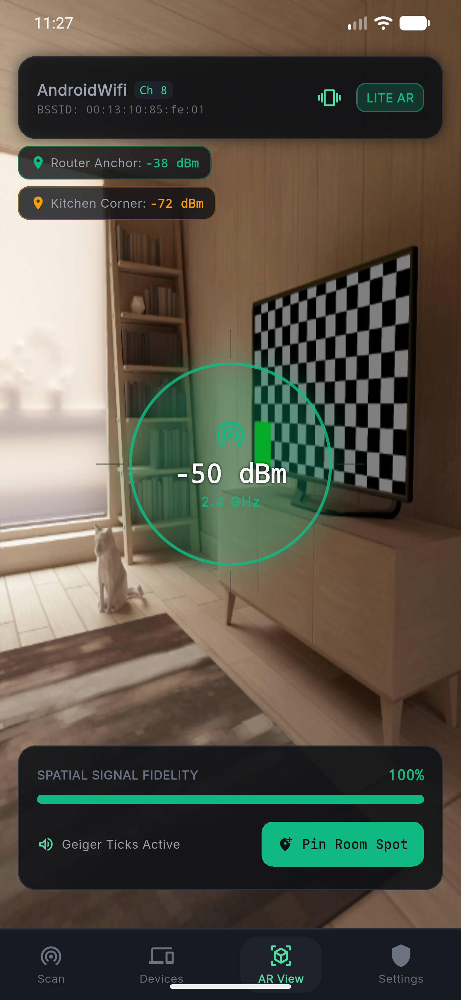
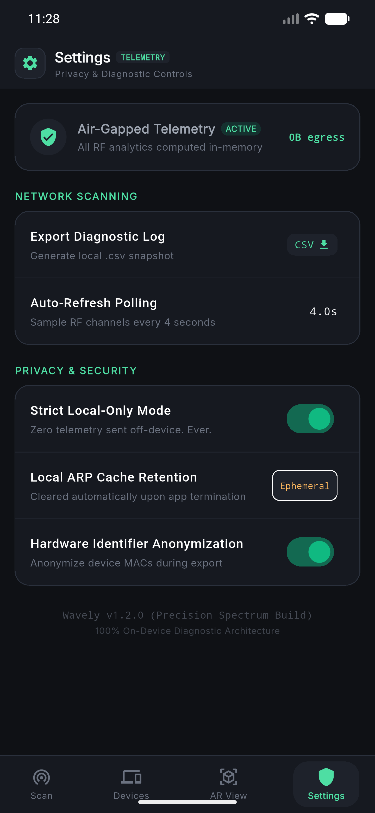

# Wavely — Precision Spectrum Wi-Fi Analyzer

<div align="center">

```
  ██╗    ██╗ █████╗ ██╗   ██╗███████╗██╗  ██╗   ██╗
  ██║    ██║██╔══██╗██║   ██║██╔════╝██║  ╚██╗ ██╔╝
  ██║ █╗ ██║███████║██║   ██║█████╗  ██║   ╚████╔╝ 
  ██║███╗██║██╔══██║╚██╗ ██╔╝██╔══╝  ██║    ╚██╔╝  
  ╚███╔███╔╝██║  ██║ ╚████╔╝ ███████╗███████╗██║   
   ╚══╝╚══╝ ╚═╝  ╚═╝  ╚═══╝  ╚══════╝╚══════╝╚═╝   
```

**An air-gapped, privacy-first, professional Wi-Fi Spectrum Analyzer & LAN Diagnostic Suite.**  
*Engineered with Flutter, native Kotlin platform bridges, zero cloud egress, and a 100% on-device diagnostic AI.*

[](https://flutter.dev)
[](https://dart.dev)
[](https://www.android.com)
[](#-architecture--project-structure)
[](#-privacy--zero-cloud-egress)
[](LICENSE)

</div>

---

## 📖 Executive Summary

**Wavely** translates complex Radio Frequency (RF) physics, spectral contention, and local subnet telemetry into plain-English, actionable diagnostics. Designed under the **Precision Spectrum** design philosophy, Wavely provides a high-density, dark OLED interface tailored for both everyday homeowners and network engineers.

- **100% Air-Gapped & Zero Cloud Egress**: All RF scans, MAC OUI vendor resolutions, mDNS/NetBIOS hostname lookups, and latency metrics run strictly on the local device. No analytics, no telemetry, no remote servers.
- **Dual-Tier UX Paradigm**: Switch effortlessly between an intuitive, plain-English **Beginner Mode** and a deep-telemetry **Pro Mode**.
- **Real Subnet Discovery Engine**: Pure on-device scanning utilizing mDNS PTR reverse queries (UDP 5353), NetBIOS name queries (UDP 137), UPnP/HTTP discovery, and concurrent socket probing without phantom devices.
- **Dual-Hop Latency & Bufferbloat Isolation**: Simultaneously tests gateway airtime vs. upstream WAN routing to pinpoint whether lag is caused by Wi-Fi congestion or your Internet Service Provider.
- **Lite AR Spatial Viewfinder**: Camera HUD overlay with real-time signal reticle, dynamic Geiger-counter tactile haptics, and spatial room pinning.

---

## 📱 Application Visual Showcase

<div align="center">

### Diagnostic & Spectrum Intelligence
| 🟢 Beginner Diagnostic Dashboard | 🔵 Pro Spectrum Analyzer & Latency |
| :---: | :---: |
|  |  |
| **Health Score & AI Diagnostics**<br/>*Circular health gauge (0–100), offline rule-based AI engine, and connected network telemetry.* | **Parabolic RF Curves & Dual-Hop Latency**<br/>*Live 2.4/5 GHz spectral power curves, gateway airtime vs. ISP WAN bufferbloat isolation.* |

<br/>

### LAN Subnet Intelligence & Node Telemetry
| 🌐 Connected Subnet Inventory | 🔍 Hardware Node Deep Telemetry |
| :---: | :---: |
|  |  |
| **Zero-Cloud Subnet Discovery**<br/>*Pure on-device mDNS PTR, NetBIOS, and UPnP discovery with offline MAC OUI vendor resolution.* | **Deep Node Hardware Telemetry**<br/>*Link attenuation, session traffic counters, MAC vendor signatures, and DHCP telemetry.* |

<br/>

### Spatial AR & Air-Gapped Controls
| 🎯 Spatial AR Viewfinder | 🛡️ Air-Gapped Privacy Hub |
| :---: | :---: |
|  |  |
| **Lite AR Signal HUD & Geiger Haptics**<br/>*Live camera reticle scaling with RSSI, tactile Geiger pulse vibration, and room anchor pins.* | **0-Byte Egress & Privacy Controls**<br/>*Zero external network calls, ephemeral ARP cache wiping, and RFC-4180 diagnostic exports.* |

</div>

---

## 🌟 Comprehensive Feature Tour

### 1. Dual-Tier RF Scanning Hub (`HomeDashboardScreen`)

#### 🟢 Beginner Mode

<p align="center">
  
</p>

- **CustomPainter Circular Health Score Gauge (0–100)**:
  - Dynamically calculated from signal attenuation (dBm), co-channel/adjacent-channel overlap count, link speed, and encryption security standard.
  - Smooth semantic color transitions (Emerald `≥ 80`, Amber `50–79`, Rose `< 50`).
- **Rule-Based Diagnostic AI Card**:
  - 100% offline, deterministic inference engine (`RuleBasedAiEngine`).
  - Classifies RF anomalies into plain-English verdicts:
    - *Critical Signal Attenuation*: Actionable advice on router placement and wall absorption.
    - *Co-Channel Congestion*: Pinpoints conflicting channel numbers and recommends the clearest channel.
    - *Security Vulnerability*: Detects legacy WPA/WEP and open networks, recommending WPA3/WPA2-Enterprise upgrades.
- **Connected Network Header**:
  - Live SSID, BSSID, security standard, channel, frequency band (2.4 GHz, 5 GHz, 6 GHz), link speed (Mbps), and dBm signal quality bar.

#### 🔵 Pro Mode

<p align="center">
  
</p>

- **Overlapping RF Parabolic Curves (`fl_chart`)**:
  - Visualizes spectral power distribution across 2.4 GHz (Channels 1–14) and 5 GHz (Channels 36–165).
  - Parabolic bell curves reflect standard 20 MHz, 40 MHz, and 80 MHz channel widths with real-time dBm amplitude peaks.
  - Interactive band switcher pills: `Both`, `2.4 GHz`, and `5 GHz`.
- **Dual-Hop Latency & Jitter Diagnostic Card (`LatencyJitterCard`)**:
  - Concurrently pings the **Local Gateway Hop** (LAN airtime) and **Public WAN Target** (e.g., `1.1.1.1` / `8.8.8.8`).
  - Computes packet jitter standard deviation (`±X.X ms`) and bufferbloat index.
  - Generates clear root-cause conclusions:
    - *"LAN airtime is clean. Latency is caused by ISP upstream routing."*
    - *"High packet jitter detected at gateway. Wi-Fi channel airtime contention."*
- **Raw BSSID Telemetry Table**:
  - Live inventory of neighboring access points with hardware MAC, SSID, frequency (MHz), channel width, 802.11 standard (Wi-Fi 7 / 802.11be, Wi-Fi 6 / 802.11ax, Wi-Fi 5 / 802.11ac, Wi-Fi 4 / 802.11n), and dBm signal meter.
- **Air-Gapped CSV Snapshot Exporter**:
  - One-tap generation of RFC-4180 compliant CSV diagnostic logs saved to local storage with native platform share sheet integration.

---

### 2. Connected Devices & Subnet Inventory (`ConnectedDevicesScreen`)

<p align="center">
  
  &nbsp;&nbsp;&nbsp;&nbsp;
  
</p>

Wavely's LAN engine discovers active nodes on your `/24` subnet without relying on any external cloud APIs:

- **Zero-Cloud Hostname Discovery**:
  - **mDNS PTR Reverse Queries (UDP 5353)**: Interrogates `.in-addr.arpa` multicast records to resolve real Apple/Bonjour and Android device names (e.g. `Md’s MacBook Air`, `Android.local`).
  - **NetBIOS Name Resolution (UDP 137)**: Queries RFC 1001/1002 name services to dynamically identify Windows workstations (e.g. `DESKTOP-2C8FUHA`).
  - **UPnP / HTTP Service Discovery**: Queries Gateway XML endpoints (port 1980 / 80) to extract exact manufacturer and router model (e.g. `Tenda Wireless-N Broadband Router`).
  - **Zero Phantom Devices**: Uses concurrent socket verification (ports 80, 443, 8080, 137, 5353, 22) so only genuine, active devices appear.
- **Offline OUI Vendor Engine**:
  - Fast, local prefix dictionary mapping MAC addresses to manufacturers (Tenda, Apple, Google, Intel, TP-Link, Ubiquiti, Samsung, etc.).
  - Handles modern private/randomized MAC addresses with clear labeling.
- **Priority Unknown Device Alerting**:
  - Highlights unverified or newly joined MAC addresses with hazard rose border styling, active alerts count, and quick-action "Inspect" / "Block Node" workflows.
- **Deep Device Telemetry View (`DeviceDetailScreen`)**:
  - Signal attenuation meter, session traffic counter (GB), peak speed (MB/s), IP address, subnet mask, physical MAC address, vendor OUI, and DHCP lease duration.

---

### 3. Spatial AR Viewfinder & Geiger Haptics (`ArViewfinderScreen`)

<p align="center">
  
</p>

- **Camera Viewfinder HUD Overlay**:
  - Live native camera preview with a fallback simulated spatial gradient for virtualized test environments.
  - Sub-pixel hairline crosshairs and heads-up display.
- **Pulsating Target Reticle**:
  - Central reticle scales and changes color dynamically based on real-time RSSI signal strength:
    - 🟢 **Emerald**: `≥ -60 dBm` (Optimal Signal)
    - 🟡 **Amber**: `-61 to -75 dBm` (Moderate / Attenuation)
    - 🔴 **Hazard Rose**: `< -75 dBm` (Weak Signal / Dead Zone)
- **Geiger-Counter Tactile Haptics**:
  - Real-time haptic feedback (`HapticFeedback.selectionClick()`) where pulse frequency scales dynamically with signal strength, allowing users to physically "feel" Wi-Fi hotspots and blind spots.
- **Spatial Room Signal Pinning**:
  - Drop location-tagged pins (e.g., *"Router Anchor: -38 dBm"*, *"Kitchen Corner: -72 dBm"*) to map room coverage throughout your home or office.

---

### 4. Settings & Air-Gapped Privacy Hub (`SettingsHubScreen`)

<p align="center">
  
</p>

- **0-Byte Egress Indicator**: Confirms that zero network telemetry is leaving the device.
- **Ephemeral ARP Cache Retention**: Wipes cached subnet device tables upon application termination.
- **MAC Anonymization Toggle**: Masks sensitive hardware identifiers during diagnostic CSV export.
- **Developer / Diagnostic Controls**: Manual refresh triggers, diagnostic logs, and platform bridge telemetry.

---

## 🎨 Design System: "Precision Spectrum"

Wavely uses a custom-engineered, OLED-optimized design system built with Vanilla Flutter widgets and strict semantic color tokens:

| Token | Hex Value | Purpose |
|---|---|---|
| **`surface0`** | `#0F1115` | OLED True Black Background Substrate |
| **`surface1`** | `#161920` | Primary Diagnostic Card Background |
| **`surface2`** | `#1E222B` | Elevated Modules, Badges, and Pill Toggles |
| **`borderHairline`** | `#262B36` | Sub-pixel Dividers and Card Borders (1px) |
| **`emeraldBright`** | `#10B981` | Optimal Signal (`≥ -60 dBm`), Healthy Nodes, Optimal Diagnostics |
| **`amber`** | `#F59E0B` | Moderate Attenuation (`-61 to -75 dBm`), Channel Overlap Warning |
| **`rose`** | `#F43F5E` | Weak Signal (`< -75 dBm`), Rogue MAC Alerts, Critical Congestion |
| **`textPrimary`** | `#FFFFFF` | Primary Headers, Titles, and Prominent Readouts |
| **`textSecondary`**| `#94A3B8` | Subtitles, Metric Units, and Secondary Information |
| **`textMuted`** | `#64748B` | Timestamps, Labels, and De-emphasized Annotations |

- **Typography**:
  - `Inter`: Executive hierarchy, headings, and diagnostic descriptions.
  - `JetBrains Mono` / Monospace: Raw dBm values, BSSIDs, IP addresses, channels, frequencies, and ping timings.

---

## 🏗️ Architecture & Project Structure

Wavely follows a clean, feature-first architecture powered by **Riverpod** state management:

```
wavely/
├── android/
│   └── app/src/main/kotlin/com/wavely/wavely/
│       └── MainActivity.kt               # Native Wi-Fi scan & NetworkCallback bridge
├── ios/
│   └── Runner/
│       └── AppDelegate.swift             # iOS HotspotNetwork bridge implementation
├── lib/
│   ├── core/
│   │   ├── constants/
│   │   │   └── app_theme.dart            # Precision Spectrum colors, typography, theme
│   │   └── utils/
│   │       └── csv_exporter.dart         # RFC-4180 air-gapped CSV report generator
│   ├── features/
│   │   ├── ar_viewfinder/
│   │   │   └── presentation/screens/
│   │   │       └── ar_viewfinder_screen.dart # Lite AR HUD, Geiger haptics, room pins
│   │   ├── devices/
│   │   │   ├── data/
│   │   │   │   ├── models/
│   │   │   │   │   └── connected_device.dart # Connected node model & factory parser
│   │   │   │   └── services/
│   │   │   │       └── device_scanner_service.dart # mDNS, NetBIOS, UPnP, OUI resolver
│   │   │   └── presentation/
│   │   │       ├── providers/
│   │   │       │   └── devices_provider.dart # Riverpod device state & auto-refresher
│   │   │       └── screens/
│   │   │           ├── connected_devices_screen.dart # Subnet list & rogue alerts
│   │   │           └── device_detail_screen.dart     # Node hardware telemetry
│   │   ├── diagnostic_engine/
│   │   │   └── domain/
│   │   │       └── rule_based_ai_engine.dart # 100% offline rule-based diagnostic AI
│   │   ├── diagnostics/
│   │   │   ├── data/services/
│   │   │   │   └── ping_service.dart         # Gateway vs WAN ICMP latency engine
│   │   │   └── presentation/widgets/
│   │   │       └── latency_jitter_card.dart  # Bufferbloat & jitter isolation card
│   │   ├── navigation/
│   │   │   └── presentation/screens/
│   │   │       └── main_navigation_screen.dart # 4-tab 64px bottom navigation shell
│   │   ├── scanner/
│   │   │   ├── data/
│   │   │   │   ├── models/
│   │   │   │   │   └── wifi_network.dart     # BSSID, RSSI, channel, standard models
│   │   │   │   └── services/
│   │   │   │       └── wifi_scanner_service.dart # Native bridge client & emulator fallback
│   │   │   └── presentation/
│   │   │       ├── providers/
│   │   │       │   └── scanner_providers.dart# Scan polling, health score, active network
│   │   │       ├── screens/
│   │   │       │   └── home_dashboard_screen.dart # Dual-tier Beginner/Pro dashboard
│   │   │       └── widgets/
│   │   │           ├── channel_graph.dart    # Parabolic spectral curves (fl_chart)
│   │   │           └── health_score_gauge.dart # CustomPainter circular health gauge
│   │   └── settings/
│   │       └── presentation/screens/
│   │           └── settings_hub_screen.dart  # Air-gap status, cache, privacy toggles
│   └── main.dart                             # Entry point, ProviderScope, dark theme
└── test/
    └── unit/
        └── rule_based_ai_engine_test.dart    # Unit test suite for offline diagnostic AI
```

---

## ⚡ Native Platform Bridges

### Android Implementation (`MainActivity.kt`)
- **MethodChannel**: `"com.wavely.app/wifi_scanner"`
- **Android 12+ (API 31+) NetworkCallback**: Registers `NetworkCallback` with `FLAG_INCLUDE_LOCATION_INFO` so that connected Wi-Fi SSIDs and BSSIDs are never redacted as `<unknown ssid>`.
- **Full Hardware Information (`getDeviceInfo`)**:
  - Resolves device model (`Build.MODEL`), manufacturer (`Build.MANUFACTURER`), local IP, gateway router IP, netmask, router BSSID MAC (`gatewayMac`), and physical interface MAC (`deviceMac`).
- **Standard Detection (`detectWifiStandard`)**:
  - Detects Wi-Fi 7 (802.11be), Wi-Fi 6 (802.11ax), Wi-Fi 5 (802.11ac), and Wi-Fi 4 (802.11n).
- **Security Parsing (`parseSecurity`)**:
  - Detects WPA3-Personal (SAE), WPA2-PSK, WPA, WEP, and Open networks.

---

## 🚀 Getting Started

### Prerequisites
- [Flutter SDK](https://docs.flutter.dev/get-started/install) (`v3.24.0` or newer)
- Android SDK (API Level 28+ recommended; tested on Android 14 / API 34)
- Physical Android/iOS device or Android Emulator

### Installation & Run

1. **Clone the repository**:
   ```bash
   git clone <repo_url>
   cd wavely
   ```

2. **Install Flutter dependencies**:
   ```bash
   flutter pub get
   ```

3. **Verify code quality**:
   ```bash
   flutter analyze
   ```

4. **Run unit tests**:
   ```bash
   flutter test
   ```

5. **Build debug APK**:
   ```bash
   flutter build apk --debug
   ```

6. **Deploy to a connected device or emulator**:
   ```bash
   flutter run
   ```

---

## 📲 Wireless ADB Deployment (Physical Device)

To test and run Wavely wirelessly on a physical Android phone (e.g. Google Pixel, Samsung Galaxy):

1. On your phone, enable **Developer Options** and **Wireless Debugging**.
2. Pair or connect via ADB over your local Wi-Fi:
   ```bash
   adb connect <device-ip>:<port>
   ```
3. Verify your device is attached:
   ```bash
   adb devices -l
   ```
4. Install the debug build:
   ```bash
   adb -s <device_id> install -r build/app/outputs/flutter-apk/app-debug.apk
   ```
5. Launch the application:
   ```bash
   adb -s <device_id> shell am start -n com.wavely.wavely/.MainActivity
   ```

---

## 🧪 Automated Testing

Wavely includes a unit test suite covering the offline diagnostic engine:

```bash
flutter test
```

Test coverage includes:
- ✅ **Signal Drop Detection**: Triggers attenuation warnings when RSSI falls below `-70 dBm`.
- ✅ **Co-Channel Congestion**: Identifies high-overlap channels and recommends optimal alternative channels.
- ✅ **Security Risk Detection**: Flags open / unencrypted networks and guides users to modern WPA3/WPA2 security.
- ✅ **Channel Boundary Validations**: Correct channel frequency mapping for both 2.4 GHz and 5 GHz bands.

---

## 🛡️ Privacy & Security Commitments

1. **Strictly Air-Gapped**: Zero outbound network requests are dispatched to any analytics or remote telemetry server.
2. **Zero Third-Party SDKs**: No Google Analytics, no Firebase, no advertising trackers.
3. **Volatile Memory Only**: Subnet discovery results and ARP mappings reside solely in ephemeral memory and are cleared when the app closes.
4. **User-Controlled Exports**: Diagnostic logs and CSV snapshots are saved strictly to the app's local sandbox and shared only upon explicit user action.

---

## 📄 License

This project is open-source software licensed under the [MIT License](LICENSE).
